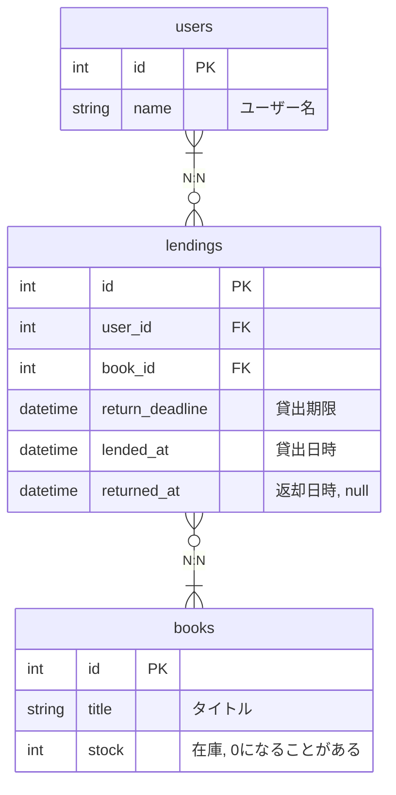
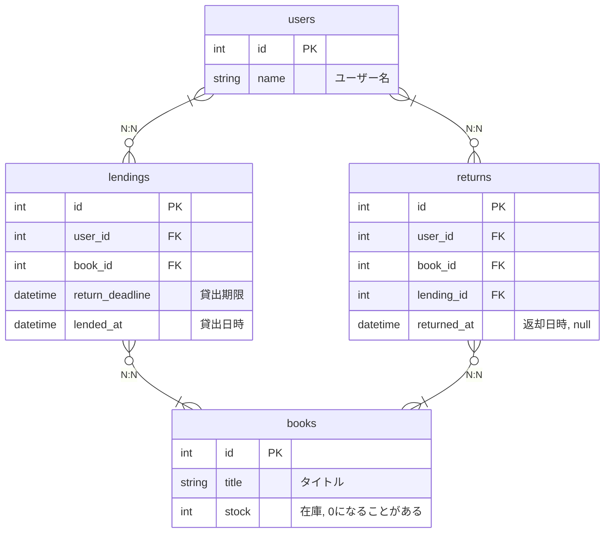

# 1. 図書館の蔵書貸出システム

## 要件

- 利用者（会員）が本を借りたり返却したりする
- 本は複数のコピー（冊）がある
- 貸出履歴を記録し、延滞日数も計算できるようにしたい

## 設計ポイント

- 会員、書籍、蔵書（コピー）、貸出履歴のテーブル構成
- 主キー・外部キーの設定
- 延滞計算のために貸出日・返却日をどう扱うか

## 設計

シンプルに実装。

イベントソーシングを取り入れ、イベントごとに独立して記録する案。

